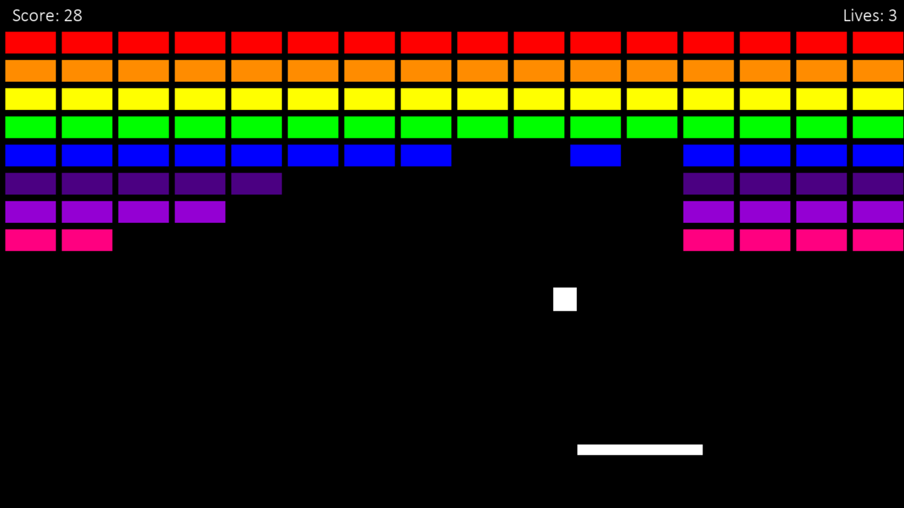

# Breakout

### About
This is a simple recreation of the video game Breakout, created by Atari in 1976. This version is created in Python using Pygame to create the graphics. The game is played by using the arrow keys to control the paddle. Each game begins with three lives and one is lost each time the ball goes off the bottom of the screen without being caught by the paddle. A score is also calculated for each game with the maximum possible score being 128.

### Motivation
After coding some basic projects in Python, I wanted to see what I could create that went beyond just text on a screen. This is the first project I have created that involves graphics and it was a great way for me to learn Pygame whilst creating a game that I enjoyed playing as a child. 

### Screenshots
  

### Libraries
**Built with:**
- [Pygame](https://www.pygame.org/news)

### Installation
In order for the python program to run the following libraries must be installed on the system:
- [Pygame](https://www.pygame.org/news)

### Status
Whilst the game is playable, there is a bug that occurs occasionally that causes the ball to get stuck to one of the walls. This is something I will work to eliminate and will hopefully be resolved in a future version.
If this bug occurs during playing, please use the ESC key to exit the program and restart it to begin a new game.

